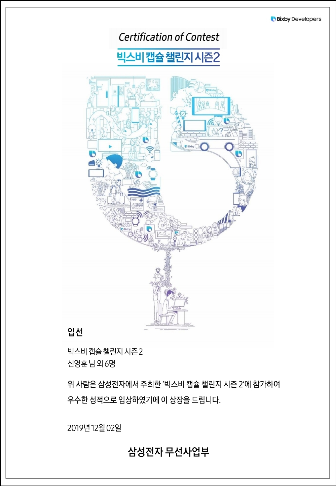

# LoLkipedia

[](https://camo.githubusercontent.com/3bef61b2d0bb7fc0edb5d35ed5e53bf946491185/687474703a2f2f696d672e736869656c64732e696f2f3a6c6963656e73652d6d69742d677265656e2e737667) [](https://camo.githubusercontent.com/0e4f27ebcc7eb4c9a937375b0860a21bb72c2b52/68747470733a2f2f696d672e736869656c64732e696f2f62616467652f706c6174666f726d2d62697862792d626c75652e737667) [](https://camo.githubusercontent.com/552b727e7badd412e61641b770e936a2ddbe99d6/68747470733a2f2f696d672e736869656c64732e696f2f62616467652f6c616e67756167652d6a6176617363726970742d627269676874677265656e2e737667)

LoLkipedia는 League of Legends 게임플레이에 도움이 되는 정보를 제공하는 Bixby 캡슐입니다.

#### Bixby 마켓플레이스 - '롤키피디아'

## 주요 기능

1. [챔피언 정보](#챔피언-정보)
2. [카운터 픽](#카운터-픽)
3. [추천 스킬 트리](#추천-스킬-트리)
4. [추천 룬](#추천-룬)
5. [추천 아이템](#추천-아이템)

### 챔피언 정보

챔피언의 카운터 픽, 스킬 트리, 룬, 아이템 추천 정보를 간략하게 보여줍니다.

각 정보 카드를 클릭하면 해당 정보로 넘어갑니다.

```
발화 hint
"롤 위키에서 가렌 정보 보여줘"
```


### 카운터 픽

챔피언의 카운터 챔피언 3개를 보여줍니다.

챔피언 클릭 시 해당 챔피언의 정보 페이지로 넘어갑니다.

```
발화 hint
"롤 위키에서 가렌 카운터픽 알려줘"
```


### 추천 스킬 트리

챔피언의 스킬트리를 추천해줍니다.

```
발화 hint
"롤 위키에서 가렌은 스킬 뭐 찍어"
```


### 추천 룬

챔피언의 룬 세팅을 추천해줍니다.

```
발화 hint
"롤 위키에서 가렌 룬 추천해 줘"
"롤 위키에서 가렌 룬특 뭐 찍어"
```


### 추천 아이템

챔피언의 시작 아이템과 최종 아이템을 추천해줍니다.

```
발화 hint
"롤 위키에서 가렌 아이템 뭐 갈까"
"롤 위키에서 가렌 템 추천해 줘"
```

## Developer

신영훈 [@young31](https://github.com/young31)

- 팀장, 백엔드

하지수 [@JeesooHa](https://github.com/JeesooHa)

- 기획, 프론트엔드

김강현 [@blueboy1593](https://github.com/blueboy1593)

- 기획, 프론트엔드

임건혁 [@GH-Lim](https://github.com/GH-Lim)

- 프론트엔드, 백엔드

박재성 [@pjs56ww](https://github.com/pjs56ww)

- 프론트엔드, DB

윤성민 [@min1378](https://github.com/min1378)

- 백엔드, DB

이신호 [@SINHOLEE](https://github.com/SINHOLEE)

- 백엔드, DB

## Release

[LoLkipedia Release Note](https://github.com/Lolkipedia/Lolkipedia/releases)


## Bixby Capsule Challenge Season2

